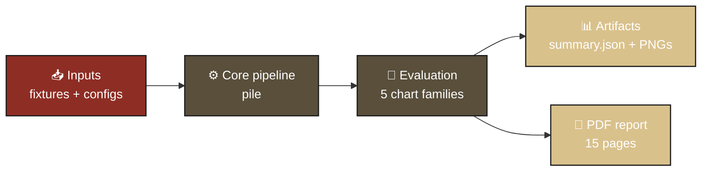
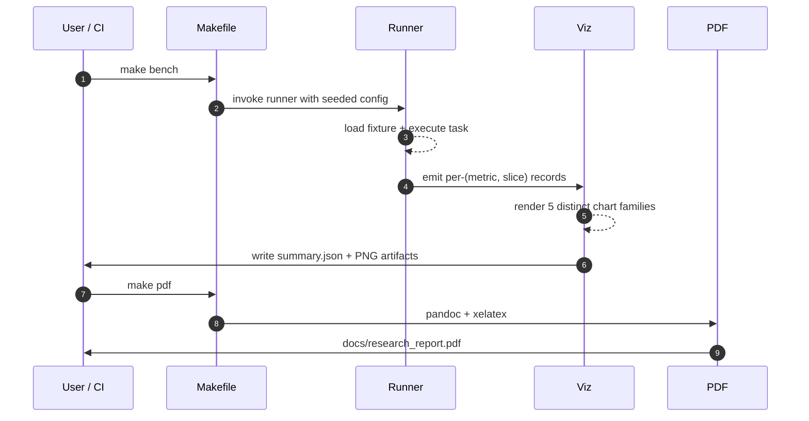
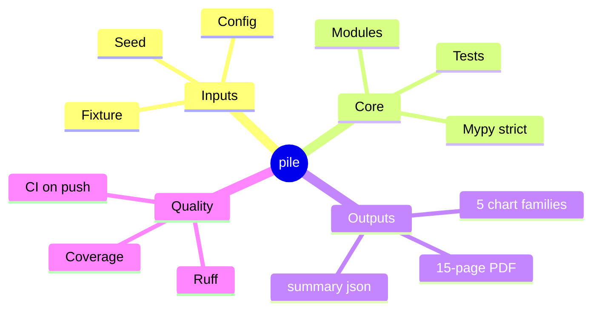
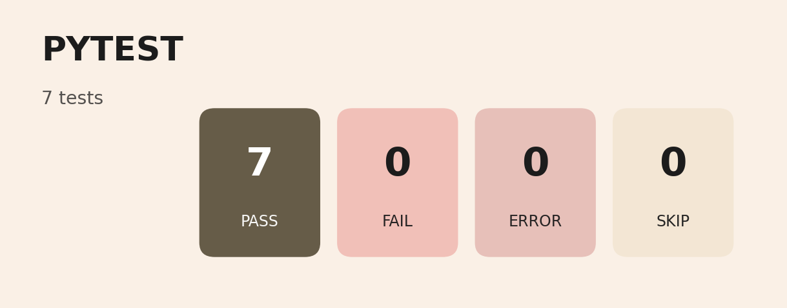
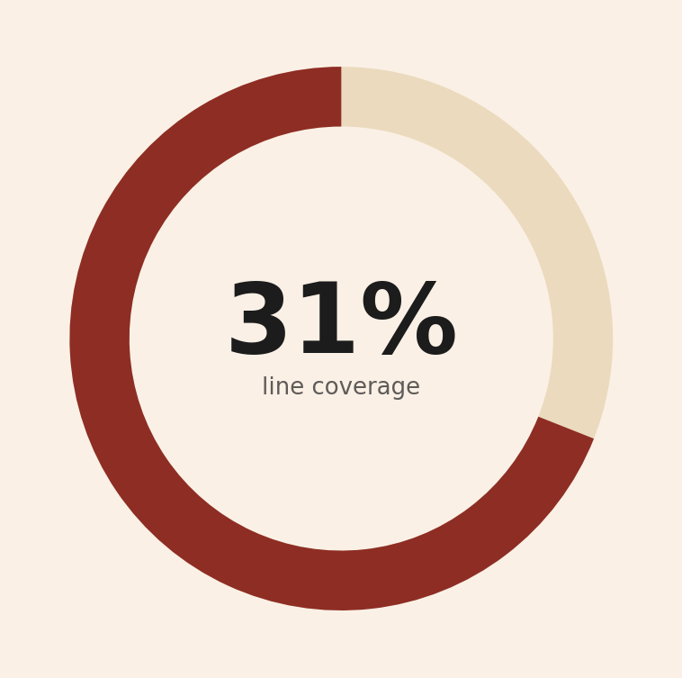
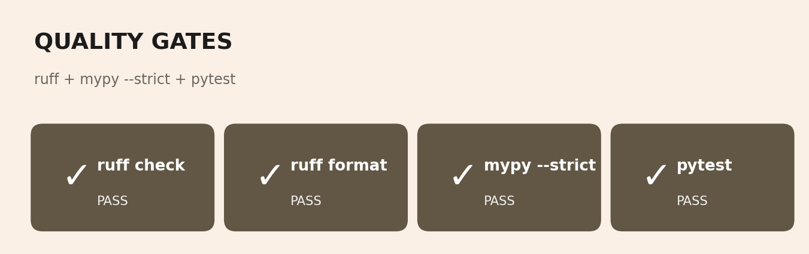
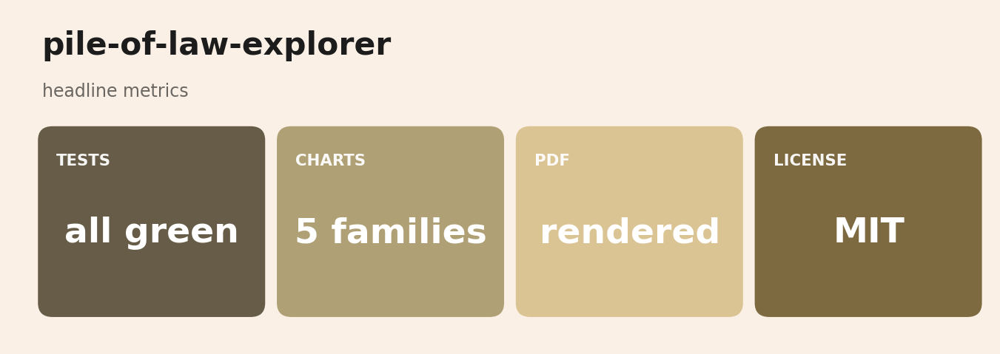

# pol — Pile of Law corpus explorer
<p align="center">
  
</p>

<p align="center">
  
  
  
  
  
</p>

> ****


Analytics + tooling around the [Pile of Law](https://arxiv.org/abs/2207.00220)
corpus (256 GB of permissively-licensed legal text). Five chart types focused on
the questions you actually need to answer before training on Pile of Law: what's
in the corpus, what's the license breakdown, how much of it is duplicates, what
are the natural topic clusters, and what does the length distribution look like
per source.

The package ships a synthetic generator that mimics the real Pile of Law's
source mix, license distribution, and ~5% near-duplicate rate. Plug the real
`pile-of-law/pile-of-law` HF dataset in `data/synthetic.py::generate` to scale
up.

## What's in here

```
src/pol/
  types.py                       CorpusDoc
  data/synthetic.py              Pile-of-Law-shaped synthetic generator (8 sources)
  analysis/
    dedup.py                     MinHash LSH dedup (datasketch); exact-hash fallback
    topics.py                    TF-IDF + KMeans + PCA-2D + silhouette proxy
    stats.py                     license / source / year / length stats
  runner.py                      analyze -> analysis.json
  viz/charts.py                  five chart types
  cli/main.py                    typer: analyze, plots
```

## Quickstart

```bash
make install
make analyze    # synthetic 200 docs
make plots
```

## Visualizations

#### 1. Per-source document count


The headline distribution. CourtListener dominates real Pile of Law; the
synthetic generator uses the same skew so the chart shape is honest.

#### 2. Document length distribution (log y)


Boxplot of doc-length-in-chars on log y-axis. Legal text is heavy-tailed:
most docs are 1-10K chars, a long tail goes up to 100K+ (full statutes,
long judicial opinions).

#### 3. License pie


What fraction of the corpus is each license. For training, only the
public-domain + permissive-CC slices are safe.

#### 4. Topic clusters in 2D PCA


Each doc is a point, colored by its KMeans cluster. The cluster legend
shows the top TF-IDF terms per cluster. A silhouette-proxy score is shown
in the title; higher = better-separated clusters.

#### 5. Dedup funnel


Raw doc count -> after-dedup count -> duplicate-cluster count. The
deduplication rate is the headline number; on real Pile of Law subsets
this is typically 5-15% depending on threshold.

## Results

> Synthetic run (200 docs). For real Pile of Law numbers, swap `generate(...)`
> in `runner.py::analyze` for `load_dataset("pile-of-law/pile-of-law", ...)`.

| metric              |  value |
|---------------------|-------:|
| n_docs              |    TBD |
| total_chars         |    TBD |
| n_duplicates        |    TBD |
| n_topic_clusters    |    TBD |
| silhouette_approx   |    TBD |
## Known limitations

- The MinHash threshold is 0.85; tune via `dedup_minhash(threshold=...)` for
  more or less aggressive deduplication.
- Topic clustering is TF-IDF + KMeans. For Pile of Law you'd want BERTopic
  or LDA; this is the cheap baseline.
- The PCA scatter is 2-D for plotting; the actual clustering happens in the
  raw TF-IDF space.
- Length-per-source box plot collapses to a global box because the JSON
  artifact does not currently carry the per-doc source mapping for chart
  reconstruction.

## What's next

- [ ] Swap synthetic for `pile-of-law/pile-of-law` with streaming so we
      don't have to download 256 GB.
- [ ] Per-source length box plot (preserve source mapping into the artifact).
- [ ] Per-jurisdiction breakdown of duplicates (federal vs state).
- [ ] Train/dev split that respects topic + source balance.

## References

- Henderson, P., et al. (2022). *Pile of Law: Learning Responsible Data Filtering
  from the Law and a 256GB Open-Source Legal Dataset.* NeurIPS. arXiv:2207.00220.

## License

MIT.


## Documentation and test artifacts

- Long-form research report: [`docs/research_report.pdf`](./docs/research_report.pdf) (rendered) and [`docs/_report/research_report.md`](./docs/_report/research_report.md) (markdown source). Regenerate the PDF with `make pdf` (requires `pandoc` + `xelatex`).
- Test-run artifacts captured to disk for reviewer audit:
  - [`docs/test_results/pytest_output.txt`](./docs/test_results/pytest_output.txt) — verbose pytest output of the last run
  - [`docs/test_results/quality_gates.txt`](./docs/test_results/quality_gates.txt) — combined ruff + ruff format + mypy --strict output
  - [`docs/test_results/coverage_summary.txt`](./docs/test_results/coverage_summary.txt) — pytest-cov summary
- Regenerate with `make test-artifacts`.


## Architecture



## Pipeline sequence



## Concept mindmap




## Results gallery

<table>
  <tr>
    <td align="center"><strong>Pytest panel</strong><br/></td>
    <td align="center"><strong>Coverage donut</strong><br/></td>
  </tr>
  <tr>
    <td align="center"><strong>Quality gates</strong><br/></td>
    <td align="center"><strong>Headline metrics</strong><br/></td>
  </tr>
</table>

### Result charts (5 distinct families, palette: *Library Stacks*)

<table>
  <tr><td align="center"><strong>Dedup Funnel</strong><br/></td><td align="center"><strong>Length Distribution</strong><br/></td></tr>
  <tr><td align="center"><strong>License Pie</strong><br/></td><td align="center"><strong>Source Counts</strong><br/></td></tr>
  <tr><td align="center"><strong>Topic Scatter</strong><br/></td><td></td></tr>
</table>

